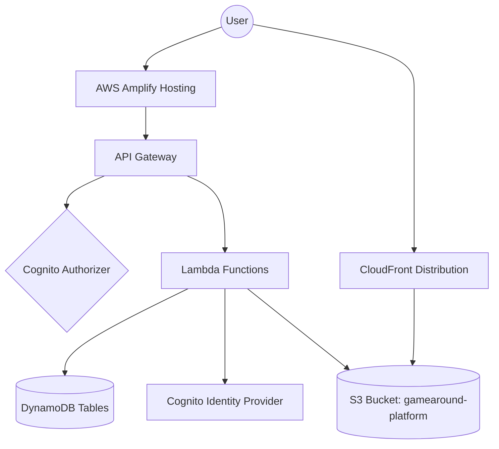

# Gamearound Dashboard Documentation

This document provides a comprehensive overview of the Gamearound Dashboard project, covering its application logic and the AWS infrastructure required to run it.

## 1. Project Overview
The Gamearound Dashboard is a multi-tenant administrative interface for managing game configurations, users, and assets. It is built using a serverless architecture on AWS, with a Vue 3 frontend and Node.js Lambda backend.

---

## 2. App Logic

### 2.1 Frontend Architecture
- **Framework**: [Vue 3](https://vuejs.org/) (Composition API)
- **Build Tool**: [Vite](https://vitejs.dev/)
- **Styling**: SCSS (Vanilla-first approach for premium aesthetics)
- **State Management**: [Pinia](https://pinia.vuejs.org/)
- **Routing**: [Vue Router](https://router.vuejs.org/)
- **Authentication**: [AWS Amplify (Auth)](https://docs.amplify.aws/lib/auth/getting-started/q/platform/js/)

### 2.2 Authentication Flow
1. **Sign In**: Users sign in via AWS Cognito.
2. **Session Management**: Amplify handles the SRP (Secure Remote Password) protocol and token refreshing.
3. **Multi-tenancy**: Upon login, the user's `custom:company_id` claim is extracted from the ID token. This ID is used to scope all data requests.
4. **RBAC (Role-Based Access Control)**: Permissions are stored in the `gadash_users` DynamoDB table. The frontend hides/shows UI elements based on these permissions, and the backend enforces them on every request. Key permissions include:
    - `manage_users`: Allows CRUD operations on users.
    - `manage_games`: Allows CRUD operations on games.
    - `manage_currencies`: Allows managing game virtual currencies.
    - `manage_config_catalog`: Allows managing game configurations and items.
    - `manage_json_templates`: Allows managing JSON structures/templates.
    - `admin`: Super-user permission required for sensitive operations (e.g., modifying other admins).

### 2.3 API Service Layer
- **Axios Instance**: A centralized axios instance (`src/services/api.js`) handles all communication with the backend.
- **Request Interceptor**: Automatically attaches the Cognito JWT (Bearer token) to the `Authorization` header of every request.
- **Base URL**: Points to the Amazon API Gateway staging endpoint.

---

## 3. Application Sections

The dashboard is organized into the following functional areas:

### 3.1 Dashboard (Home)
- **Purpose**: Provides a high-level overview of the company's activities.
- **Features**: Displays aggregate statistics like total number of users and games managed by the company.

### 3.2 User Management
- **Purpose**: Administration of dashboard users and their access levels.
- **Features**: 
    - Create new users and invite them to the company.
    - Manage user status (Active/Inactive).
    - Assign granular permissions (RBAC).
    - Integrated with AWS Cognito for identity management.

### 3.3 Game Management
- **Purpose**: Centralized registry of games owned by the company.
- **Features**: 
    - Register new games with unique identifiers.
    - Update game metadata.
    - Games serve as the primary scope for Currencies and Config Catalog items.

### 3.4 Currencies
- **Purpose**: Manage virtual economies within each game.
- **Features**: 
    - Define multiple currencies per game.
    - Configure launch deposits (initial balance for new players).
    - Associate assets (icons/images) with currencies via S3 upload.

### 3.5 Config Catalog
- **Purpose**: The core configuration engine for game items and assets.
- **Features**: 
    - Create and manage catalog items (items, bundles, etc.).
    - Define pricing, availability (limited amounts), and usage limits.
    - Integrated JSON Builder for complex payloads using Templates.
    - Supports duplicating existing configurations for rapid iteration.

### 3.6 JSON Templates
- **Purpose**: Reusable blueprints for complex configuration payloads.
- **Features**: 
    - Define structured JSON schemas (attributes with types: string, number, object, array).
    - Used by the Config Catalog to ensure consistency and prevent manual JSON entry errors.

### 3.7 Asset Management (Media)
- **Purpose**: Integrated file handling for game assets.
- **Features**: 
    - S3-backed storage with CloudFront distribution.
    - Presigned URL generation for secure, direct-to-S3 uploads from the browser.
    - Automatic path organization: `/assets/{gameId}/{category}/{recordId}_{fileName}`.

---

## 4. AWS Infrastructure

### 4.1 Architecture Overview


### 4.2 Hosting & CI/CD
- **Platform**: [AWS Amplify Hosting](https://aws.amazon.com/amplify/hosting/)
- **CI/CD Workflow**: The application is connected to the project's Git repository. Any push to the main/staging branches triggers an automatic build and deployment.
- **Environment**: Managed staging/production environments with automated SSL certificates.

### 4.3 Configuration Details
| Component | Value |
| :--- | :--- |
| **AWS Region** | `eu-central-1` (Frankfurt) |
| **App URL** | `https://main.d2d3ydw8jtdnj7.amplifyapp.com` |
| **API Endpoint** | `https://4wk6506a85.execute-api.eu-central-1.amazonaws.com/staging` |
| **Cognito User Pool ID** | `eu-central-1_BIxQEi7ju` |
| **Cognito Client ID** | `19u81s4v4sd3mmmbnuog2vfc1e` |
| **CloudFront URL** | `https://du1ui0vdk1uj4.cloudfront.net` |
| **CloudFront ID** | `E1EM764W7W2XM1` |
| **S3 Asset Bucket** | `gamearound-platform` |

### 4.4 DynamoDB Tables
The system uses the following tables (all in `eu-central-1`):

#### `gadash_users`
- **Partition Key**: `userId` (String)
- **GSI (`companyIdIndex`)**: Partition Key: `companyId`
- **Attributes**: `email`, `name`, `permissions` (List), `status`, `companyId`, etc.

#### `gadash_companies`
- **Partition Key**: `companyId` (String)

#### `gadash_games`
- **Partition Key**: `gameId` (String)
- **GSI (`companyIdIndex`)**: Partition Key: `companyId`, Sort Key: `createdAt`

#### `gadash_json_templates`
- **Partition Key**: `companyId` (String)
- **Sort Key**: `templateId` (String)

#### `gap_config_catalog` (game table)
- **Partition Key**: `category` (String)
- **Sort Key**: `itemid` (String)
- **GSI (`gameidIndex2`)**: Partition Key: `gameid`
- **Attributes**: `assetId`, `bundle`, `currency`, `description`, `imageUrl`, `limitedAmount`, `maxTime`, `maxUses`, `name`, `payload`, `price`, `stackable`, `tradable`, `inAppPurchase`

#### `gap_config_currency`  (game table)
- **Partition Key**: `gameid` (String)
- **Sort Key**: `id` (String)
- **Attributes**: `name`, `launchDeposit` (Number), `assetUrl`, `imageUrl`, `createdAt`, `updatedAt`.

### 4.5 Lambda Functions
| Function | Primary Responsibility | Tables Accessed |
| :--- | :--- | :--- |
| `users` | CRUD for users, RBAC check, Cognito Admin ops | `gadash_users`, `gadash_companies`, `gadash_games` |
| `games` | CRUD for games, ownership verification | `gadash_users`, `gadash_games` |
| `currencies` | CRUD for game currencies | `gadash_users`, `gadash_games`, `gap_config_currency` |
| `configCatalog` | CRUD for catalog items, game ownership check | `gadash_users`, `gadash_games`, `gap_config_catalog` |
| `jsonTemplates`| CRUD for JSON templates | `gadash_users`, `gadash_json_templates` |
| `assets` | Generates S3 presigned URLs for uploads | `gadash_games` |
| `createCompany`| (One-time) company & admin user creation | `gadash_companies`, `gadash_users` |
| `fixes` | One-off data migration and fix scripts (run manually) | Various |

### 4.6 API Endpoints
All endpoints are relative to the **API Endpoint** URL.

| Category | Method | Path | Description |
| :--- | :--- | :--- | :--- |
| **Auth/User** | `GET` | `/profile` | Get current user profile and company stats |
| **Users** | `GET` | `/users` | List users in the company |
| | `POST` | `/users` | Create a new user (Cognito + DB) |
| | `PATCH` | `/users/{userId}` | Update user permissions/status |
| | `DELETE` | `/users/{userId}` | Delete user (Cognito + DB) |
| **Games** | `GET` | `/games` | List games owned by the company |
| | `POST` | `/games` | Register a new game |
| | `PATCH` | `/games/{gameId}` | Update game metadata |
| | `DELETE` | `/games/{gameId}` | Delete a game |
| **Currencies** | `GET` | `/currencies/{gameId}` | List currencies for a game |
| | `POST` | `/currencies/{gameId}` | Create a new currency |
| | `PATCH` | `/currencies/{gameId}/{currencyId}` | Update currency details |
| | `DELETE` | `/currencies/{gameId}/{currencyId}` | Delete a currency |
| **Config Catalog**| `GET` | `/config-catalog/{gameId}` | List catalog items for a game |
| | `POST` | `/config-catalog/{gameId}` | Create a catalog item |
| | `PATCH` | `/config-catalog/{gameId}/{category}/{itemId}` | Update catalog item |
| | `DELETE` | `/config-catalog/{gameId}/{category}/{itemId}` | Delete catalog item |
| **JSON Templates**| `GET` | `/json-templates` | List available JSON templates |
| | `GET` | `/json-templates/{templateId}` | Get specific template details |
| | `POST` | `/json-templates` | Create a new JSON template |
| | `PATCH` | `/json-templates/{templateId}` | Update a JSON template |
| | `DELETE` | `/json-templates/{templateId}` | Delete a JSON template |
| **Assets** | `POST` | `/assets/upload` | Generate S3 presigned URL for upload |

---

## 5. Setup & Infrastructure Steps

### Step 1: AWS Amplify Hosting Setup
1. Log in to the **AWS Amplify Console**.
2. Click **"New App"** > **"Host web app"**.
3. Connect your Git provider (GitHub/GitLab/Bitbucket) and select the repository.
4. Configure build settings (Amplify usually detects Vite settings automatically).
5. Add environment variables if necessary (though the app currently uses `amplify-config.js`).
6. Enable **Auto-deploy** on commit.

### Step 2: Cognito Setup
1. Create a **Cognito User Pool** in `eu-central-1`.
2. **Attributes**: Add custom attribute `company_id`.
3. **App Client**: Create an App Client without a secret.

### Step 3: DynamoDB Setup
1. Create the tables listed in section 4.4.
2. Ensure GSIs are created with the exact names specified.

### Step 4: S3 & CloudFront Setup
1. Create an S3 bucket named `gamearound-platform`.
2. Configure **CORS** on the S3 bucket to allow `PUT` requests from the dashboard domains.
   ```json
   [
       {
           "AllowedHeaders": ["*"],
           "AllowedMethods": ["PUT", "POST", "DELETE", "GET"],
           "AllowedOrigins": [
               "http://localhost:5173",
               "https://main.d2d3ydw8jtdnj7.amplifyapp.com"
           ],
           "ExposeHeaders": ["ETag"],
           "MaxAgeSeconds": 3000
       }
   ]
   ```
3. Create a **CloudFront Distribution** (ID: `E1EM764W7W2XM1`) with the S3 bucket as the origin.
4. Set up an **Origin Access Control (OAC)** or **Origin Access Identity (OAI)** to ensure the S3 bucket is only accessible via CloudFront (`du1ui0vdk1uj4.cloudfront.net`).

### Step 5: IAM Role Configuration
Ensure Lambda functions have permissions for:
- `dynamodb:*` (scoped to `gadash_*` and `gap_*`)
- `cognito-idp:*` (for `users` lambda)
- `s3:PutObject` (for `assets` lambda presigned URLs)

---

## 6. Maintenance & Troubleshooting
- **Logs**: Check AWS CloudWatch Logs for any Lambda errors.
- **Auth Issues**: Ensure the `custom:company_id` attribute is present in the user's Cognito profile.
- **S3 Uploads**: If uploads fail, check the CORS configuration of the `gamearound-platform` bucket.
